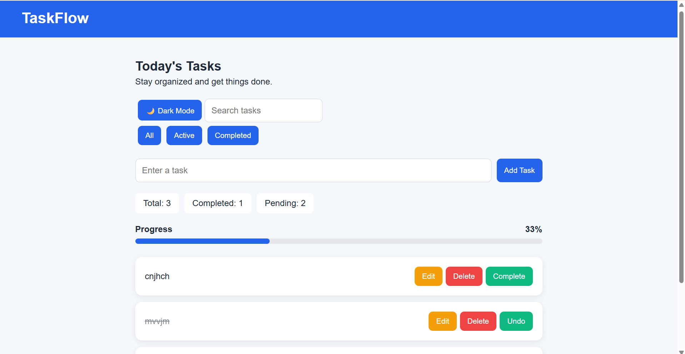
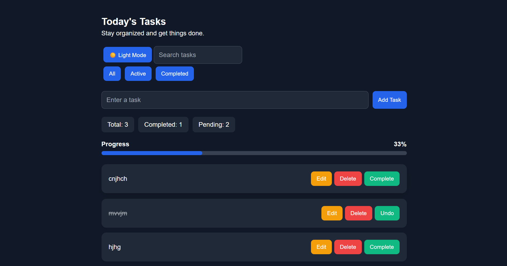

# 📋 TaskFlow

> A modern and responsive task management application built with React and Vite.

TaskFlow is a frontend task management application designed to help users organize their daily tasks efficiently. It supports task creation, editing, deletion, completion tracking, search, filtering, dark mode, progress tracking, and persistent data storage using the browser's Local Storage.

---

## ✨ Features

- ➕ Add new tasks
- ✏️ Edit existing tasks
- 🗑️ Delete tasks
- ✅ Mark tasks as completed
- ↩️ Undo completed tasks
- 🔍 Search tasks
- 📂 Filter tasks by All, Active, and Completed
- 🧹 Clear all completed tasks
- 📊 Task statistics
- 📈 Task completion progress bar
- 🌙 Dark mode
- 💾 Local Storage persistence
- 📱 Responsive design
- 📭 Empty-state handling

---

## 🖥️ Preview

### Light Mode



### Dark Mode



---

## 🛠️ Tech Stack

### Frontend

- React
- JavaScript (ES6+)
- Vite
- CSS

### Browser API

- Local Storage

### Development Tools

- Git
- GitHub
- VS Code

---

## ⚛️ React Concepts Used

This project was built to practice and demonstrate core React concepts:

- Functional Components
- JSX
- Props
- `useState`
- `useEffect`
- Event Handling
- Controlled Components
- Conditional Rendering
- List Rendering with `map()`
- Array Filtering with `filter()`
- Spread Operator
- Derived Data
- Component Composition
- Parent → Child Communication
- Lifting State Up
- Immutable State Updates

---

## 📂 Project Structure

```text
TaskFlow/
│
├── src/
│   ├── components/
│   │   ├── Navbar.jsx
│   │   ├── TaskForm.jsx
│   │   ├── TaskItem.jsx
│   │   └── TaskList.jsx
│   │
│   ├── App.jsx
│   ├── main.jsx
│   └── index.css
│
├── screenshots/
│   ├── light-mode.png
│   └── dark-mode.png
│
├── public/
├── README.md
├── package.json
├── package-lock.json
└── vite.config.js
```

---

## 🚀 Getting Started

### Prerequisites

Make sure you have installed:

- Node.js
- npm
- Git

### 1. Clone the repository

```bash
git clone : https://github.com/Devika-Subhash/TaskFlow
```

### 2. Navigate to the project

```bash
cd TaskFlow
```

### 3. Install dependencies

```bash
npm install
```

### 4. Start the development server

```bash
npm run dev
```

The application will be available at the local URL shown in your terminal.

---

## 💾 Data Persistence

TaskFlow uses the browser's **Local Storage API** to save tasks.

This means tasks remain available even after:

- Refreshing the page
- Closing and reopening the browser

No external database is required for the current version.

---

## 📊 Task Management

Each task contains:

```js
{
  text: "Learn React",
  completed: false
}
```

The application uses this data to manage:

- Task completion
- Editing
- Searching
- Filtering
- Progress calculation

---

## 🎯 Learning Goals

This project was created as part of my React learning journey to gain practical experience with:

- Building reusable React components
- Managing application state
- Handling user interactions
- Working with browser APIs
- Organizing a React project
- Using Git and GitHub
- Building responsive interfaces

---

## 🔮 Future Improvements

Potential future versions may include:

- 🔐 User authentication
- ☁️ Cloud database
- 📅 Due dates
- 🏷️ Task categories
- 🔔 Notifications
- 👥 Multi-user task management
- 🔄 Backend API integration

---

## ⭐ If you like this project

Feel free to explore the repository, suggest improvements, or use the project as a reference for learning React.
